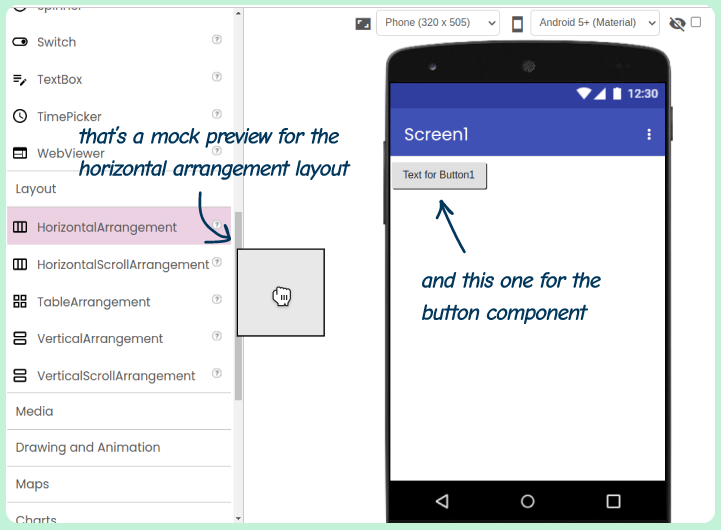
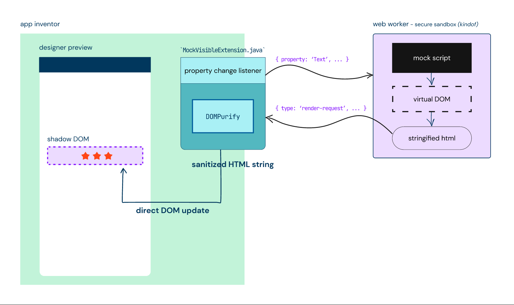

## Mock preview support for App Inventor extensions

This summer, I've been working on adding mock preview support for extensions in MIT App Inventor 2 as a part of my GSoC 
2024 project. This repo serves as the final work product submission for that.

App Inventor 2 is a no-code platform that allows you to build mobile apps visually. You don't need to write code to design 
your apps' UI, instead, you use a drag-and-drop interface for that. Mock previews form the most basic building block of 
this functionality. They are the dummy representations of components you see when dragging a component from the components 
palette and placing it inside the phone preview.



App Inventor also allows extending itself using third-party extensions. But up until now, extension developers had no way 
to add mock previews to their extensions. They could only build non-visible components that wouldn't be shown in the phone 
preview in the designer. My goal this summer was to make it possible for extensions to have mock previews all while ensuring 
security and performace of App Inventor isn't affected.

## What I did

With the completion of this project, it is now possible for extension developers to add mock previews to their extensions. 
They do this by adding a mock script, which is a JavaScript file, to their extension in which they define the base HTML 
template for the mock and how it reacts to various property changes of the extension.

Here's an example of a mock script for an extension named `MyButton`:
```js
Mock.template = () => {
  return `<button id="my-btn">Click me!</button>`;
}

Mock.onPropertyChange = (property) => {
  const btn = Mock.document.getElementById('my-btn');
  if (property.name === 'Text') {
    btn.textContent = property.value;
  }
}
```

The biggest challenge of this project was the security. Since we are basically allowing the execution of third-party code 
in App Inventor by adding support for mock previews, I had to make it sure that the implementation has no security holes 
that would anything at risk, neither App Inventor nor its users.

I spent a large part of the program researching various techniques for running third-party code on the web and evaluating 
their feasability for App Inventor's use case. I finally settled on a implementation based on Web Workers and Shadow DOM. 
I have documented the design of this implementation in [this design document](https://docs.google.com/document/d/1uogI-56rqocKeaMcatfOBU07DId_DaNQmXtAV8Tjqfw/edit?usp=sharing).



## The code

All the work I did this summer can be found at https://github.com/mit-cml/appinventor-sources/pull/3200

## Documentation

Documentation for extension developers will be published soon. For now, you can refer to the example provided in the 
[`examples`](https://github.com/shreyashsaitwal/gsoc24/tree/main/examples) directory.
